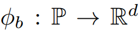
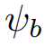
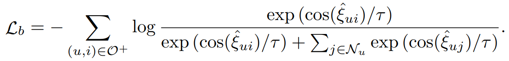
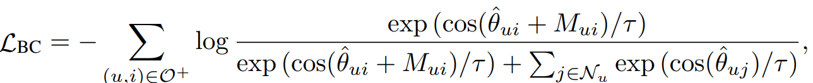
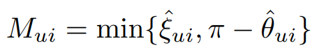
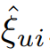
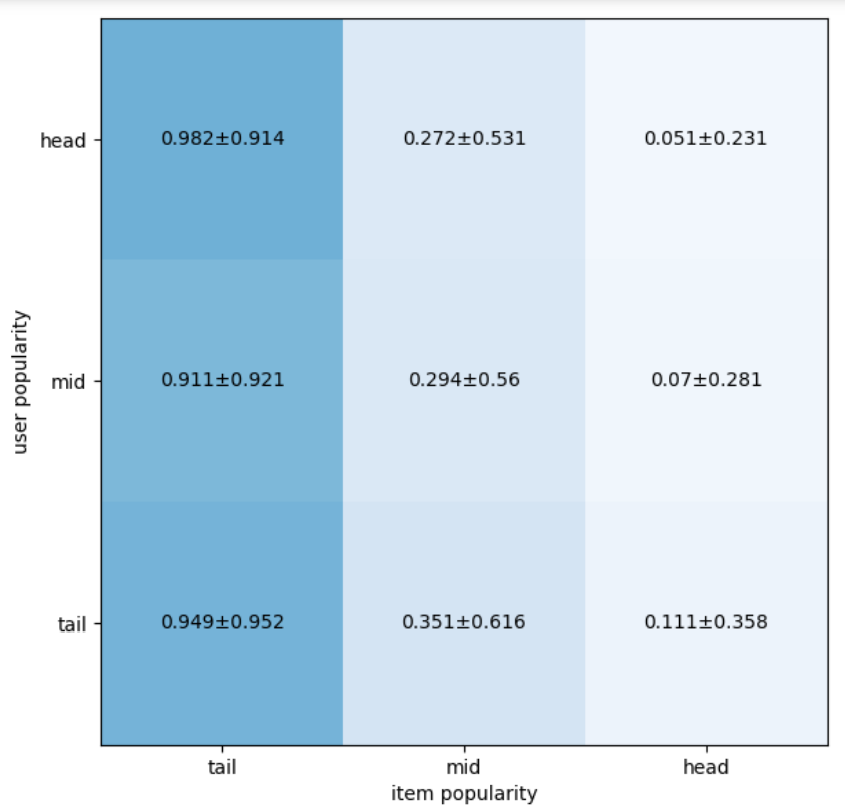

# Incorporating Bias-aware Margins into ContrastiveLoss for Collaborative Filtering
## Abstract
协同过滤（CF）模型很容易受到流行度偏差的影响，这使得推荐偏离了用户的实际偏好。然而，目前大多数去偏策略容易在头部和尾部性能之间进行权衡，因此不可避免地降低了整体推荐的准确性。为了减少流行度偏差对CF模型的负面影响，本文将Biasaware边际纳入对比性损失，并提出了一个简单而有效的BC损失，其中边际对每个用户-项目互动的偏差程度进行定量调整本文研究了BC损失的几何解释，然后进一步可视化并从理论上证明，通过鼓励相似用户/项目的紧凑性和扩大不相似用户/项目的分散性，它可以同时学习到更好的头部和尾部表征。在八个基准数据集上，本文使用BC损失来优化两个高性能的CF模型。在各种评估设置（即不平衡/平衡、时间分割、完全观察到的无偏、尾部/头部测试评估）上，BC损失以显著的改进超过了最先进的去偏和非去偏方法。考虑到BC损失的理论保证和经验上的成功，本文主张将其不仅作为一种去偏策略，而且作为推荐模型的标准损失。
## Method
### Popularity Bias Extractor
首先通过 将用户的流行度pu（即用户交互过的物品数量）映射为d维的embedding，对物品流行度pi通过进行相同操作，然后计算pu与pi之间的余弦相似度：
 通过得到的余弦相似度输入损失函数：

 中进行训练。
### BC-Loss
首先利用backbone(MF或者LightGCN)得到用户id和物品id的embeddings，然后通过损失函数
进行训练，其中Mui为：，为Popularity Bias Extractor得到的用户和物品对应的流行度偏差。

## Analysis 

通过上图可以看出BC-Loss对越尾部的用户以及物品所补偿的偏差越多，对越头部的用户以及物品的补偿越少。

## Conclusion
尽管在协同过滤方面取得了巨大的成功，但今天流行的去偏移方法仍然远远不能提高推荐质量。在这项工作中，本文提出了一个简单而有效的BC损失，利用人气偏差感知余量来消除人气偏差。在理论证明、清晰的几何解释和现实世界的可视化研究的基础上，BC损失通过学习更多的鉴别性表示空间来提升头部和尾部的性能。广泛的实验证明，在各种测试集上的头部和尾部评价的显著改善确实来自于更好的表现，而不是简单地迎合尾部。
BC损失的局限性在三个方面，这将在未来的工作中得到解决。1）偏见意识边际的建模值得探索，这可能会大大影响BC损失的性能，2）不考虑多种重要的偏见，如暴露和选择偏见，以及3）需要更多的实验来比较BC损失和标准CF损失（如交叉训练，WARP），以进一步证明BC损失在常规推荐任务中的力量（见与BPR, CCL的比较）。本文相信，这项工作为诊断长尾排名的去偏移提供了一个潜在的研究方向，并将激发更多的工作。