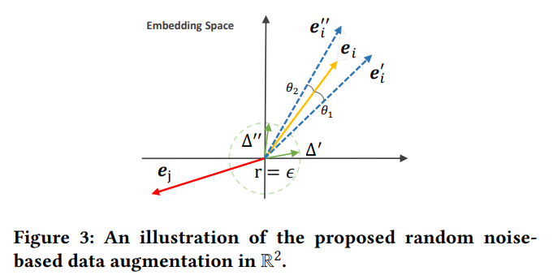
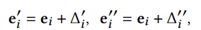
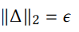
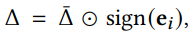
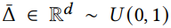
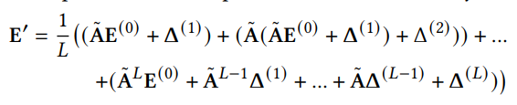

# SimGCL

## Abstract

对比学习（CL）最近在推荐领域刺激了一条富有成效的研究路线，因为它从原始数据中提取自我监督信号的能力与推荐系统在解决数据稀少问题上的需求非常吻合。基于CL的推荐模型的一个典型管道是首先用结构扰动来增强用户-项目的二方图，然后最大化不同图增强之间的节点表示一致性。尽管这种模式被证明是有效的，但性能提升的基础是什么仍然是一个谜。
基于这一发现，本文提出了一个简单的CL方法，该方法抛弃了图的增强，而是向嵌入空间添加均匀的噪声，以创建对比性视图。对三个基准数据集的综合实验研究表明，虽然看起来非常简单，但所提出的方法可以顺利地调整所学表征的统一性，在推荐精度和训练效率方面比基于图增强的同类方法有明显的优势。

## Analysis

在SGL中即使是0.9的边丢弃率依然有良好的性能提升，因此本文提出一个有意义的问题：在CL(对比损失)运用于推荐任务中时，图增强真的是必要的吗？基于该问题，本文进行了消融实验：SGL-ND表示仅执行结点丢弃，SGL-ED表示仅执行边丢弃，SGL-RW表示仅执行随机游走，SGL-WA表示不执行任何图增强操作，只使用CL-Loss以及BPR-Loss，结果如下：

可以看出SGL中的图增强操作对性能提升并不明显。

## Method

为了得到更均匀的嵌入，本文在嵌入层面提出一种增强操作，如下图所示：

其中e代表嵌入，Δ代表添加的噪声扰动，公式如下：

其中Δ需要满足下列约束：

LightGCN卷积过程如下：
最后通过CL以及BPR损失进行训练。

## Conclusion
本文重新审视了推荐中基于丢弃的CL，并研究它如何提高推荐性能。本文发现，在基于CL的推荐模型中，CL损失是核心，而图的增强只起次要作用。 优化CL损失会导致更均匀的表示分布，这有助于在推荐的情况下进行去偏。然后，本文开发了一个简单的无图增强的CL方法，以更直接的方式调节表示分布的均匀性。通过在不同的数据增强和对比度的表示中加入有向随机噪声，所提出的方法可以显著提高推荐效果。 大量的实验表明，所提出的方法优于其基于图增强的对应方法，同时训练时间也大大减少。