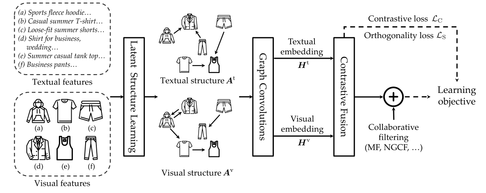
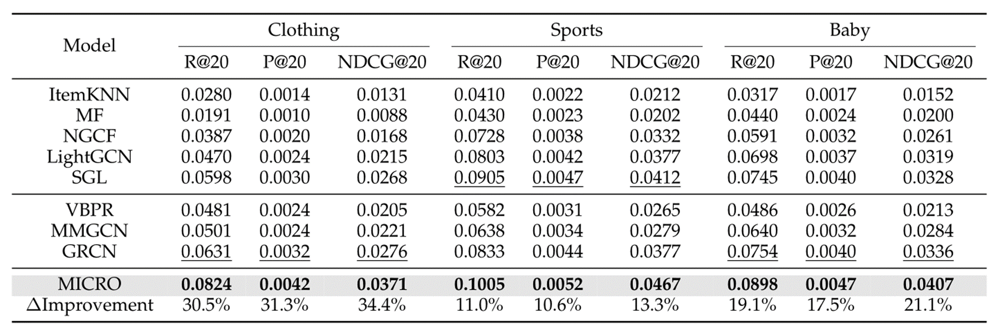
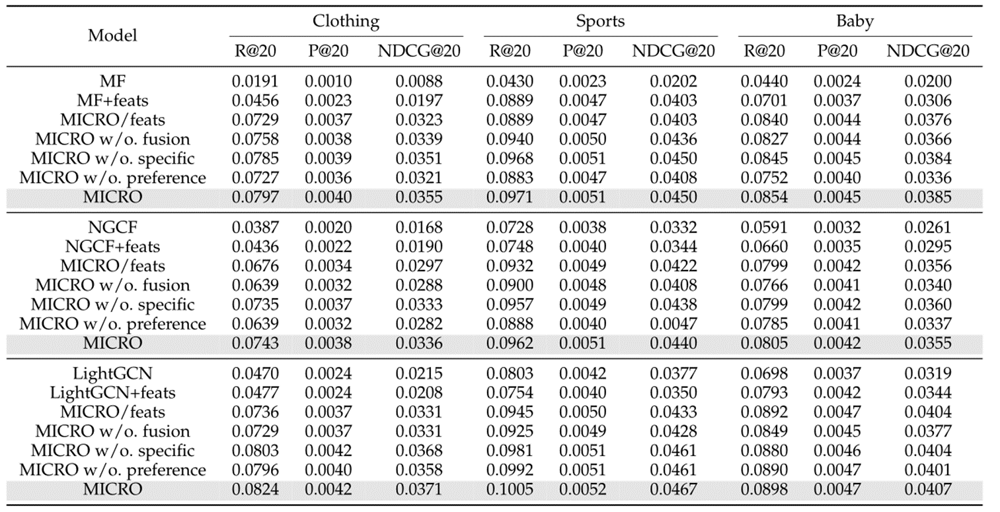

# MIRCO

MICRO：Latent Structure Mining with Contrastive Modality Fusion for Multimedia Recommendation由来自中科院大的Jinghao Zhang, Y anqiao Zhu, Qiang Liu, Member, IEEE, Mengqi Zhang创作，被收录于2022年TKDE。

摘要
---

MICRO：基于对比模态融合的多模态推荐潜在结构挖掘模型。一种基于对比模态融合模型能够挖掘潜在结构的模型。设计了一种新颖的模态感知结构学习模块，它学习每个模态的物品-物品关系。基于学习到的感知模式的潜在项目关系，执行图卷积来显式地将项目亲和力注入到感知模式的项目表示中。此外，设计了一个新的多模态对比框架，通过挖掘共享模态信息和特定模态信息来促进项目级的多模态融合。最后，将项目表示插入现有的协同过滤方法中，以做出准确的推荐。在三个真实世界数据集上的大量实验证明了模型优于现有技术。

###
模型优点
---
•强调了明确开发项目关系的重要性，并明确考虑了多媒体推荐中的项目级多模态融合。

•提出了一种新的方法来挖掘潜在的项目关系，并基于挖掘的结构进行项目级的多模态融合，该方法同时考虑了模式共享和模式特定的信息。

•在三个公共数据集上进行了广泛的实验。值得注意的是，就不同的指标而言，该方法比最先进的方法平均高出20%，验证了模型的有效性。

###
模型框架
---

### 
实验结果
---

### 
消融实验
---

总结
---
模型利用图结构学习来发现隐藏在多模态特征和设计之下的潜在项目关系，开发了一种融合多模态项目关系的新颖对比框架，包含模态感知结构学习层和图卷积，将模态感知的项目关系注入到项目表示中。此外，提出了一种新的多模态对比框架，以自监督的方式自适应地捕获多个模态之间共享的物品-物品关系。最后，所得到的增强的项目表示被注入了多种模式的项目关系，这些关系将被添加到CF模型的输出项目嵌入中，以提出推荐。在三个公共数据集上的实证结果证明了提出的模型的有效性。