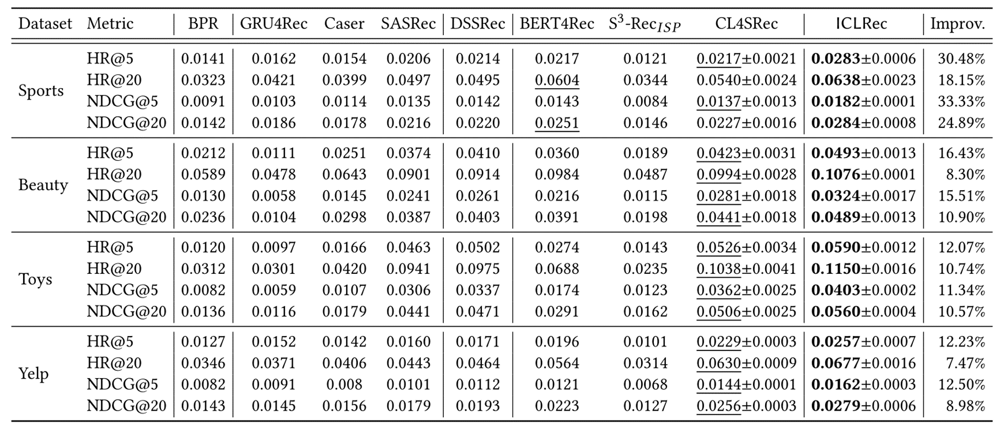
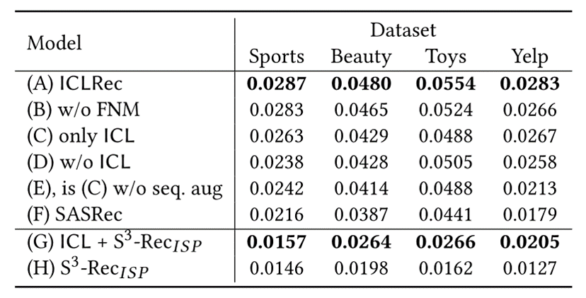

#  ICLRec
ICLRec:Intent Contrastive Learning for Sequential Recommendation是由Salesforce Research研究机构创作，被收录与2022年www

## 摘要

用户的潜在意图往往难以观测，但对序列推荐有一定影响，如下图两位用户购买了大量与钓鱼活动相关的用具，在传统推荐模型中，模型将分别向两个用户推荐相互物品，然而在这种情况下，两位用户的购物显然都被钓鱼活动驱使，那他们下一个要购买的物品可能都是钓鱼转环。这种推荐信息需要模型有潜在意图挖掘的能力。

## 模型整体框架

### 
实验结果
---

### 
消融实验
---

总结
---
在这项工作中，一种新的学习范式ICL被提出，可以从用户交互中建模潜在的意图因素，并通过一个新的对比SSL目标将它们融合到一个顺序推荐模型中。ICL是在EM框架内制定的，这保证了收敛性。详细的分析表明了ICL的优越性，在四个数据集上的实验进一步验证了所提方法的有效性。