# LANCER: A Lifetime-Aware News reCommEndeR System

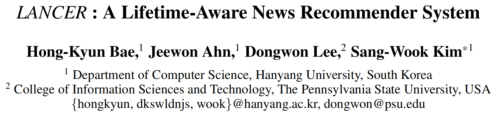

# 概念和背景

## 一、新闻“寿命”的概念

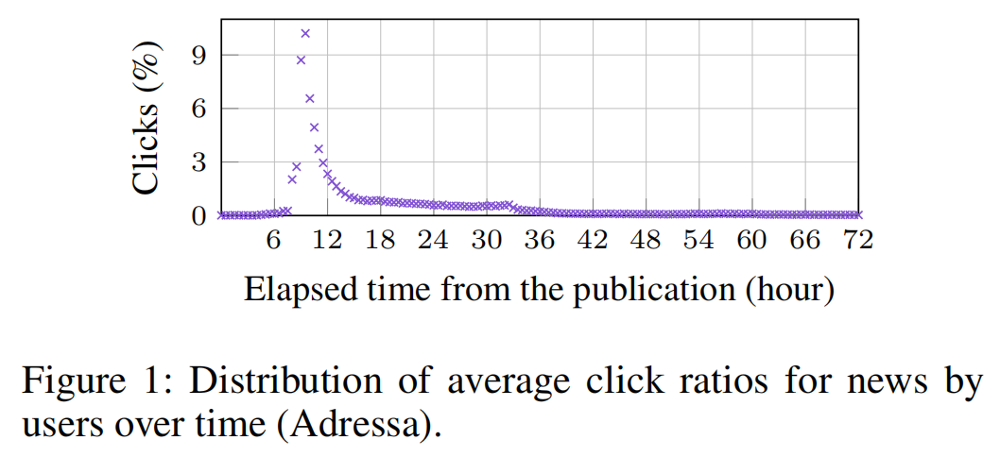

-   从发布到最后一次点击所经历的这段时间，称为新闻的“寿命”
-   优化：可设置一个范围m%（通过点击量），如本文取m=80时，Lifetime(80) = 36 hours
    （意味着36h内可以获得80%的点击量）

## 二、关于新闻“寿命”的两点假设

1.  相比于电影或商品，新闻的寿命更短

    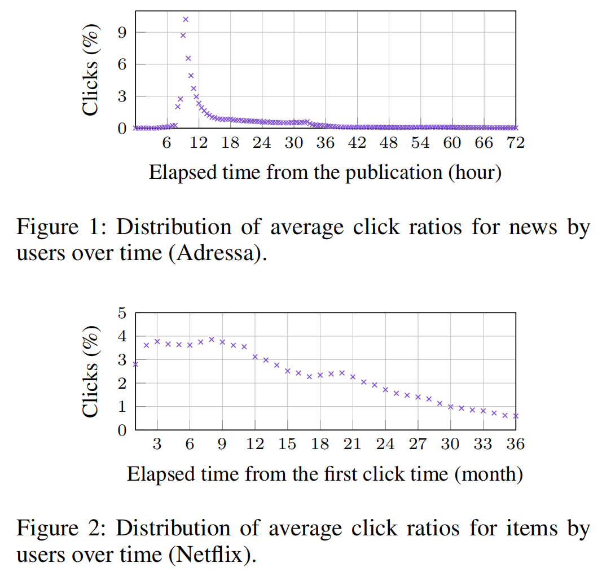
    -   平均点击率：

        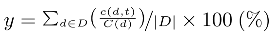

        $c(d, t)$表示项目$d$在发布时间$t$之后从所有用户那里获得的点击量；

        $C(d)$为$d$在整个时间段内获得的总点击量；

        $D$为所有新闻集合
2.  只有生命周期存在重叠的新闻之间，才存在相互竞争。（在后续「**关键点1**」中详细讨论）

## 三、相关现象与研究背景

1.  用户很少点击过时的新闻：85％的新闻点击事件，发生在发布后的48h之内。（根据MIND数据集）

    *注：存在特例，如关于圣诞节的季节性新闻，但影响不大*
2.  研究现状：目前关于新闻推荐的论文都没考虑到新闻寿命的影响

    NRMS (Wu et al. 2019c)

    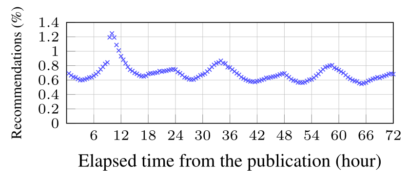

    *该模型在新闻发布48h之后依然对其进行了大量推荐，由此右侧很多推荐都是潜在的浪费*

由此，本文提出一个LANCER方法，该方法独立于现有的新闻推荐模型，因此可以与现有模型进行结合，提高其推荐的准确性。

# LANCER介绍

## 一、LANCER整体过程

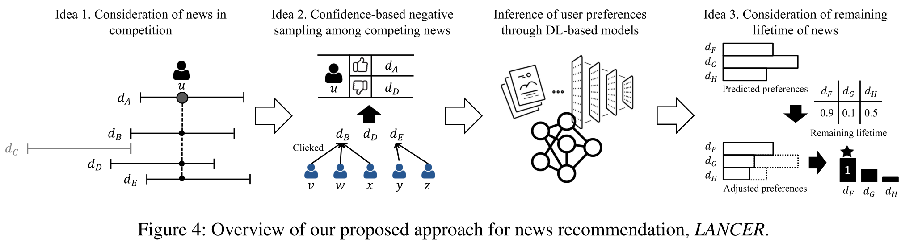

1.  在存在竞争关系的新闻中，挑选出相互对应的正面样本（被点击）和负面样本（未被点击）
2.  在选出的负面样本中，通过流行度计算，进一步将不受欢迎的新闻挑选出来，作为负面样本
3.  训练现有的基于dl 的模型，预测用户偏好
4.  考虑新闻剩余寿命的影响，调整预测偏好的分数

## 二、关键点

1.  考虑新闻之间的竞争：对于**生命周期存在重合**的两篇新闻，它们之间存在竞争关系，被点击的新闻比未被点击的新闻更受欢迎。（有限的竞争）

    （1）确定处于相互竞争中的新闻：
    -   $D$：所有新闻的集合
    -   $ctime$：重叠的生命周期
    -   $CPT(d_i）$：与新闻$d_i$存在竞争关系的新闻集合

        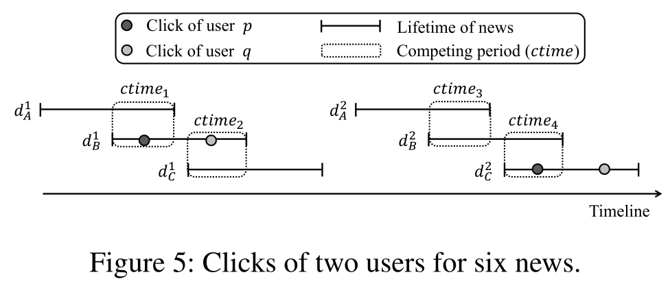
    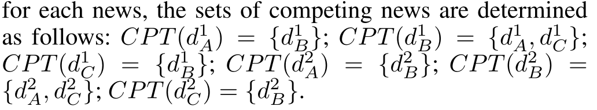

    （2）确定正面/负面新闻
    -   正面新闻：用户点击的新闻
    -   负面新闻：与上述正面新闻存在竞争，但未被点击
        只有这样得来的正负样本才能用来训练模型，如图5中的正/负新闻：
    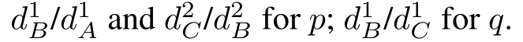

    

    *注：对比LANCER方法与现有方法：*
    |    | LANCER结论  | 现有方法结论 |
    | -- | --------- | ------ |
    | 对p | C>B>A     | B=C>A  |
    | 对q | B>C, A不确定 | B=C>A  |
2.  竞争新闻中基于置信度的负采样：大量未被点击的负面新闻中，有很多可能只是用户未注意到，而不是真的存在负面偏好。可根据其他用户的反馈计算新闻的流行程度，越不流行说明越有可能是真正的负面新闻，后续抽样负样本时会赋予其高概率。

    （1）定义置信度

    将新闻$d_j$（与正面新闻$d_i$竞争）作为负面新闻的置信度

    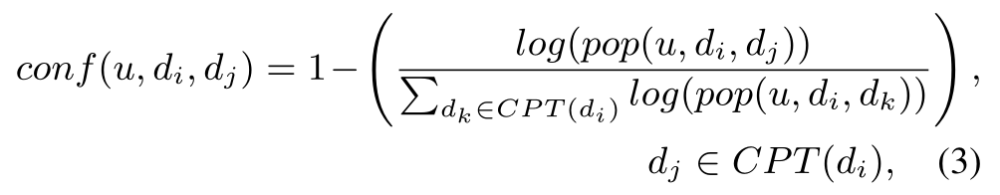
    -   $pop(u,d_i,d_j)$：在用户$u$点击$d_i$之前，点击了$d_j$的用户数量。
    -   关于$log()$：为了缓解由于流行程度的差距而可能出现的新闻可信度差异过大的情况，通过获取新闻的对数值来平滑新闻的流行性，同时确定可信度。（后续实验部分将进一步讨论）
        （2）训练模型
    由上面等式确定的置信度作为负抽样概率，确定用户的负面新闻和对应的的正面新闻，其中1个正面新闻对应k个负面新闻，将这这（k+1）个新闻一起交由模型训练。

    损失函数为：

    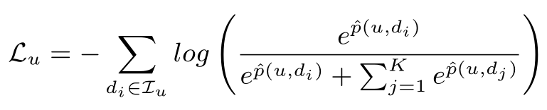
    -   $d_i,d_j$：用户$u$的正面/负面新闻
    -   $L_u$：用户$u$的正面新闻集合
    -   $\hat{p}\left(u, d_i\right) \text {, } \hat{p}\left(u, d_j\right)$：用户$u$对$d_i$和$d_j$的预测偏好
        （通过对应的embedding向量进行点积计算）
3.  考虑新闻的剩余寿命：根据新闻剩余寿命的长度，调整预测偏好分数，避免推荐已经或将要“死亡”的新闻，优先推荐“年轻”的新闻。

    使用sigmoid函数调整新闻的预测偏好值：

    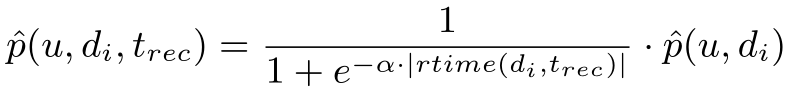
    -   α为超参数，用于控制新闻「预测偏好分数」降低的程度
        （该参数会影响推荐准确性，后续实验部分将进一步讨论）
    -   $|rtime(d_i,t_{rec})|$为新闻$d_i$在$t_{rec}$时刻的剩余寿命
        $|rtime(d_i,t_{rec})| = |ltime(d_i)| - |(t_{rec} - t_{pub(d_i)})|$

# 实验

## 一、实验准备

1.  数据集

    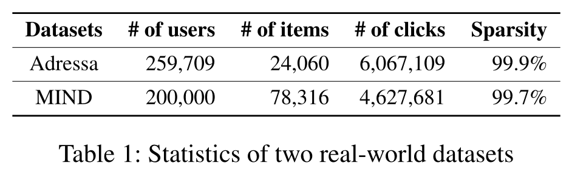
2.  评估细节
    -   三个指标：AUC; MRR; NDCG
    -   四个模型：NRMS; LSTUR; NAML; CNE-SUE
    -   95%置信度的t检验，以验证基本模型与LANCER模型间的准确性差异

## 二、实验结论

1.  通过考虑有限的竞争来确定用户的负面新闻的效果

    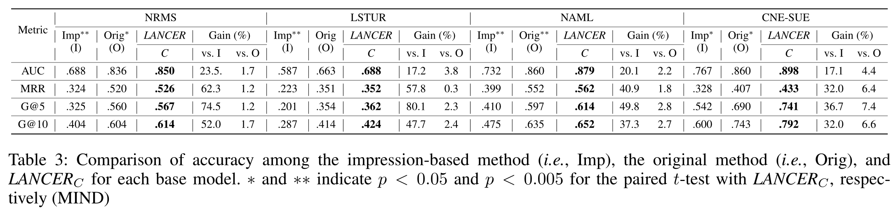
    -   Imp（基于印象）方法：

        仅从印象日志中随机抽取每个用户的K条未点击的新闻和相应的正面新闻进行训练，因为印象日志中的新闻与平台推荐给用户的新闻是相同的，它们已经接近用户的口味，因此误差将更大
2.  将基于流行度的置信度用于负抽样的效果

    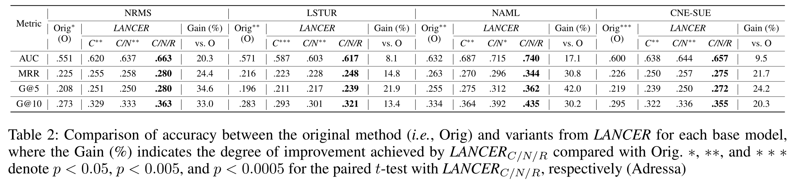
    -   附加变体$LANCER_{C/(1-N)}$：

        说明：流行度越高，作为负样本的概率也越高（与关键点2相反）
        其准确度相比原始模型下降，进一步说明关键点2的有效性

        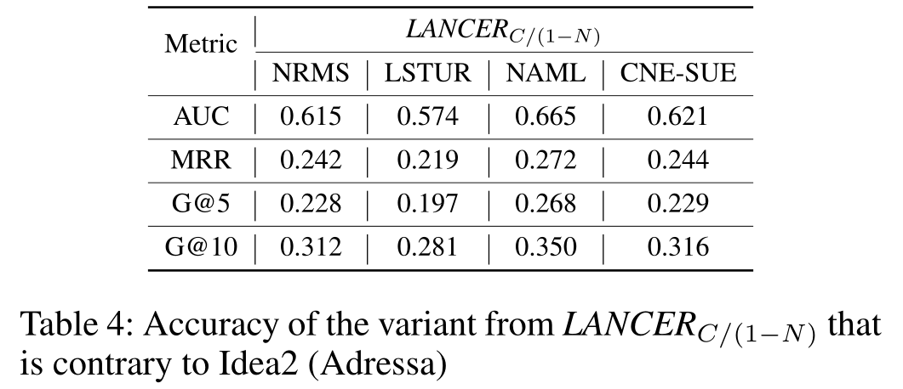
3.  通过新闻的剩余寿命调整预测偏好的效果

    

    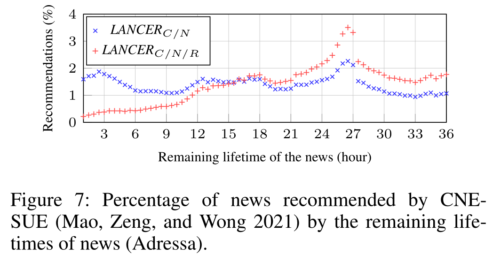
4.  用于计算负面新闻置信度的平滑函数与推荐准确度的关系

    

    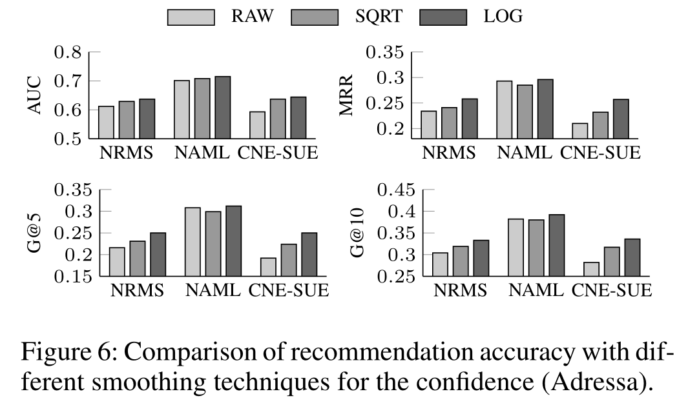
    -   由于新闻之间的流行度差异很大，在计算基于流行度的置信度时，有必要使用适当的平滑值
    -   使用$log$函数进行平滑可以获得更大精度
5.  参数α与推荐准确度的关系

    

    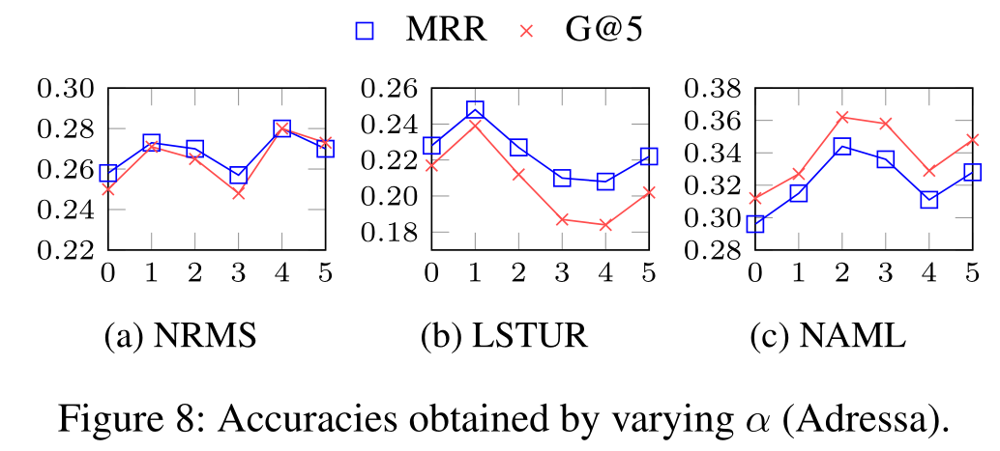
    -   x轴为$α * 10$，y轴为相应度量的精度值
