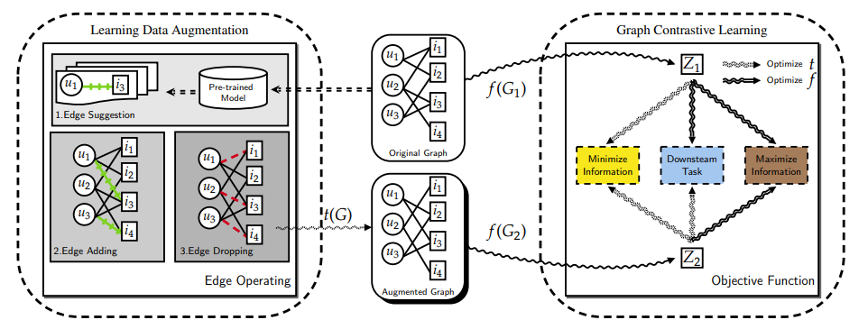
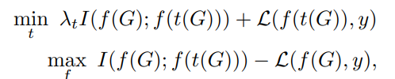
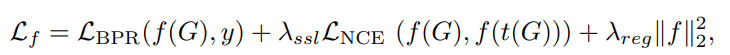
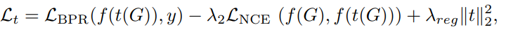

# Adversarial Learning Data Augmentation for Graph Contrastive Learning in Recommendation
## Abstract
最近，图谱神经网络（GNNs）在推荐方面取得了显著的成功。为了减少数据稀少的影响，在基于GNN的CF方法中采用了图对比学习（GCL）来提高性能。大多数GCL方法由数据增强和对比性损失（如InfoNCE）组成。GCL方法通过手工制作的图增强来构建对比对，并最大限度地提高同一节点的不同视图与其他节点的视图之间的一致性，这被称为InfoMax原则。
然而，不恰当的数据增强会阻碍GCL的性能。InfoMin原则，即好的视图集共享最小的信息，并为设计更好的数据增强提供指导。
在本文中，本文首先提出了一种新的数据增强方法（即边缘操作，包括边缘添加和边缘丢弃）。然后，在InfoMin原则的指导下，本文提出了一个新的理论指导性对比学习框架，名为图对比学习的可学习数据增强（LDA-GCL）。本文的方法包括数据增强学习和图对比学习，它们分别遵循InfoMin和InfoMax原则。在实施过程中，本文的方法优化了对抗性损失函数，以学习数据增强和用户和项目的有效表示。在四个公共基准数据集上进行的广泛实验证明了LDA-GCL的有效性。
## Moedel
### Overview

### Augmentation
首先通过预训练模型构建用户潜在的互动物品，然后根据选出的潜在物品对每个用户加边，然后再以p概率随机丢弃边，最后通过MLP构建每个用户与物品的交互概率为新的邻接矩阵。
### Training
根据InfoMax与InfoMin原则制定优化目标：
其对应的两个损失函数为：

## Conclusion
在这项工作中，本文为推荐中的GCL开发了一个有理论依据的可学习数据增强模型，而不是启发式设计。在InfoMin和InfoMax原则的指导下，本文的模型是一个对抗性框架，可以更好地提高GCL在推荐中的效果。通过在GCL中学习更好的数据增强，本文的模型在几个公共基准数据集上取得了最先进的性能。对每个组件的进一步实验证明了LDA-GCL的有效设计。本文的方法为设计可学习的数据增强方法而不是推荐中的启发式增强方法打开了大门。
本文模型的主要限制是学习数据增强的高复杂性，与简单的数据增强相比，这可能导致低训练效率。本文可以在未来的工作中对效率进行改进。一个潜在的提升方案是预先训练好的边缘操作者模型。