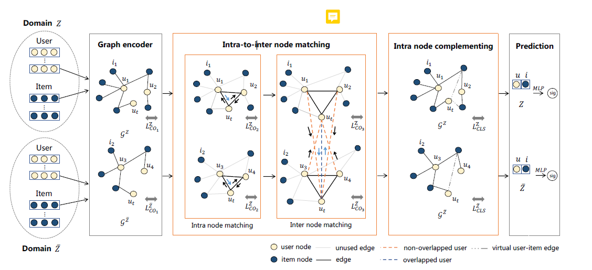
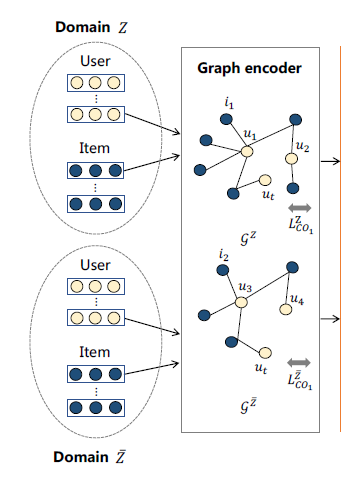
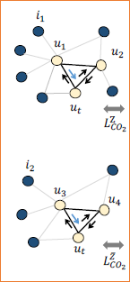
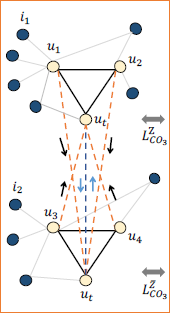
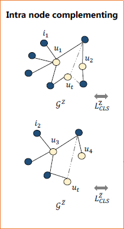

# Motivation
1. 现有的MTCDR论文没有考虑到交互数量不足的用户得到的表征可能表现力不足的问题，而这种表现力不足的表征甚至有可能会损害模型的表现
2. 现有的MTCDR模型大多假设问题背景为fully-overlapped，而实际场景中overlapped是理想化的，因此考虑针对部分overlapped的场景进行跨域迁移

# Architecture

模型主要部分分为
- Graph Encoder
- Intra-to-inter node matching
    - Intra node matching
    - Inter node matching
- Intra node complementing

# Graph Encoder

&emsp;图编码器引入邻居信息，为预训练的用户表征提供更多的信息，本文的图编码器可以使用GCN，LightGCN等GNN模型来替代，因此在此处不过多赘述，本文的图编码器架构如上图所示。

# Intra-to-inter node matching
# Intra node matching

&emsp;为了解决交互少的用户表征能力不强的问题，作者想到在域间进行更多的信息交换，因此将用户按照交互数量分成两组，分别为head用户和tail用户，其中head用户为头部用户，为正常的用户，即具有正常数量的交互，而tail用户为尾部用户，占有大量的交互，于是考虑聚合这两组用户的信息来增强用户表征。
# Inter node matching

&emsp;域间用户之间信息流通仍然是通过重叠的用户进行，而非重叠的用户的信息流通也是通过重叠的用户进行流通，从而解决partially-overlapped的问题

# Intra node complementing

&emsp;同样是解决用户交互数量少导致的表征质量差的问题，此处对域内的交互进行软链接，即将可能的交互给予一定的概率，按照这个概率认为这个交互可能产生，从而直接补充交互的数量。
