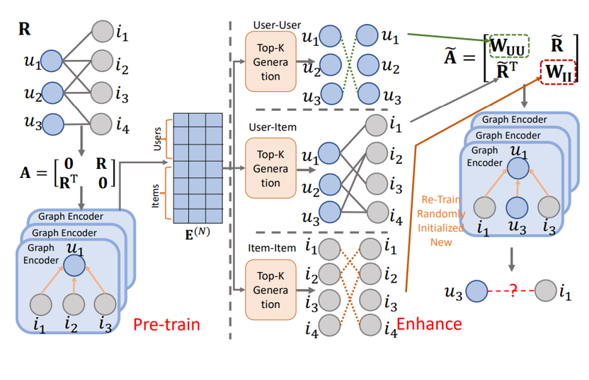
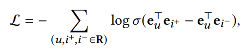
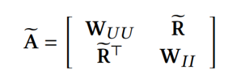

# Graph Collaborative Signals Denoising and Augmentation for Recommendation

## Abstract
图协作过滤（GCF）是一种流行的技术，用于捕捉推荐系统中的高阶协作信号。然而，GCF的双点邻接矩阵，即根据用户与物品的互动来定义被聚合的邻居，对于互动丰富的用户/物品来说可能是有噪声的，而对于互动稀少的用户/物品来说是不够的。此外，邻接矩阵忽略了用户-用户和项目-项目的相关性，这可能会限制有益邻居的聚合范围。
在这项工作中，本文提出了一个新的图邻接矩阵，它包含了用户-用户和项目-项目的相关性，以及一个适当设计的用户-项目互动矩阵，以平衡所有用户的互动数量。为了实现这一目标，本文预训练了一种基于图的推荐方法来获得用户/项目嵌入，然后通过top-K采样来增强用户-项目交互矩阵。本文还将对称的用户-用户和项目-项目相关成分增强到邻接矩阵中。本文的实验表明，增强的用户-项目交互矩阵与改进的邻居和较低的密度导致了基于图的推荐的显著优势。此外，本文表明，包含用户-用户和项目-项目的相关性可以改善对互动丰富和不充分的用户的推荐。

## Model
### Overview

### Pretrain
通过lightgcn得到用户物品嵌入利用bpr进行优化

### Enhance
通过计算相似度选出top-k个邻居，然后得到新的邻接矩阵
### Re-learn
重新初始化嵌入通过lightgcn重新进行训练
## Conclusion
本文实证研究了基于图的推荐的现有缺陷，并可以说发现问题来自于对交互邻接矩阵的不满意的定义。为了生成更好的交互邻接矩阵，本文提出了去噪和增强管道GraphDA，通过预训练和加强步骤来生成更好的用户-项目矩阵、用户-用户相关性以及项目-项目相关性。实验显示了GraphDA的优越性，特别是对于高度活跃的用户和非活跃用户。