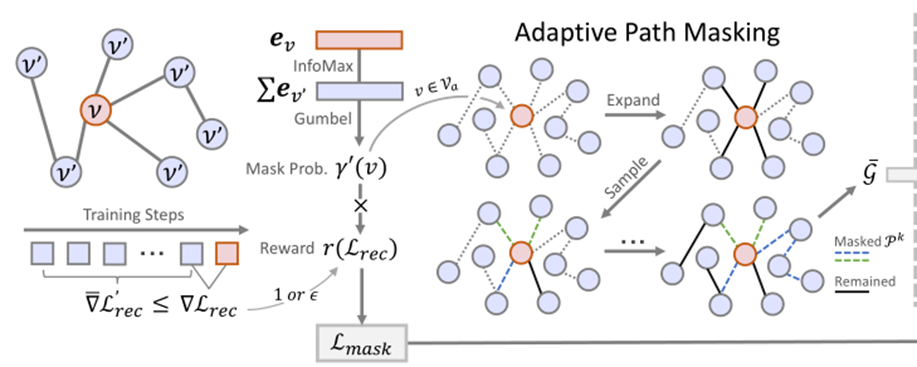
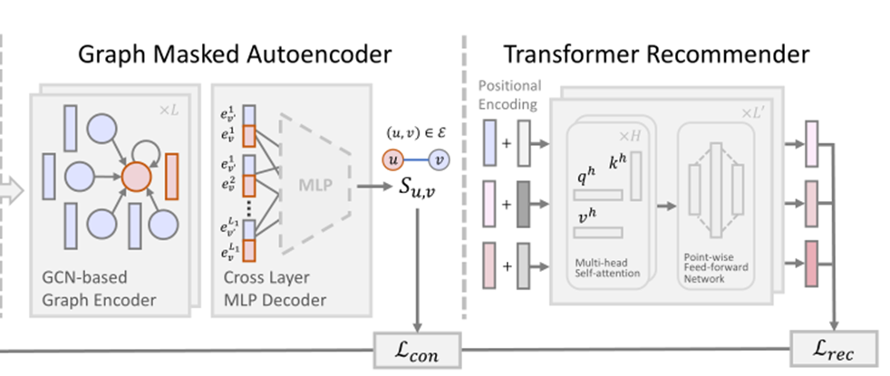
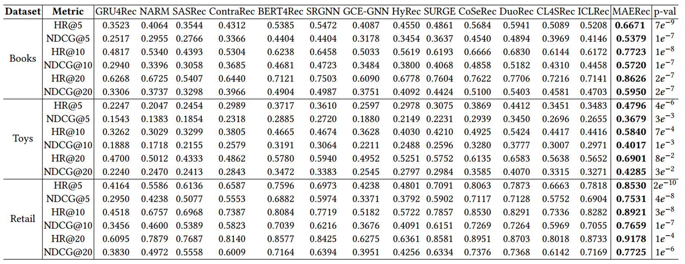

# MAERec

### 1. 介绍

MAERec 是一种简单而有效的图掩蔽自动编码器，它通过新颖的自适应过渡路径掩码策略自适应和动态地提取全局项目过渡信息以进行自我监督增强。它自然地解决了顺序推荐场景中的数据稀缺性和噪声扰动问题，并避免了大多数基于对比学习的方法中的问题。

### 2. 模型框架

### 3. 实验

### 4. 结论
这项工作提出了一种自适应数据增强方法，通过一种新的图屏蔽自动编码器来增强序列推荐系统。由于所设计的自适应路径掩蔽，我们提出的MAERec提供了具有强大自监督信号的可控和任务自适应增强。我们进行
在三个真实世界的数据集上进行了广泛的实验，并证明了我们的MAERec与最先进的基线相比具有卓越的性能。在未来的工作中，我们计划通过推广我们的分发外方法来提高SSL培训的稳定性
序列。这将有助于解决序列推荐中训练数据和测试数据之间的数据分布变化，并在未来将模型推广到新到达的项目序列。
