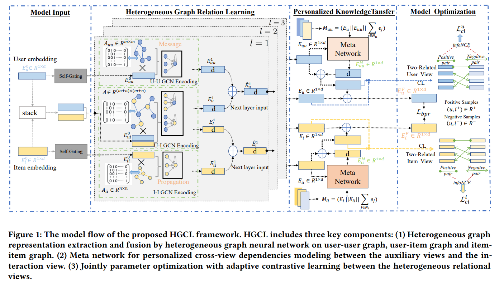
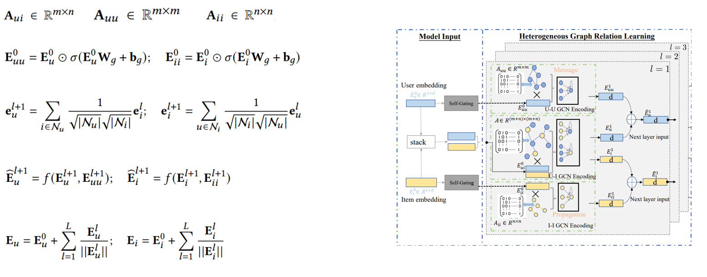
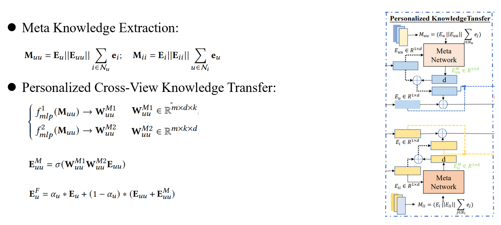
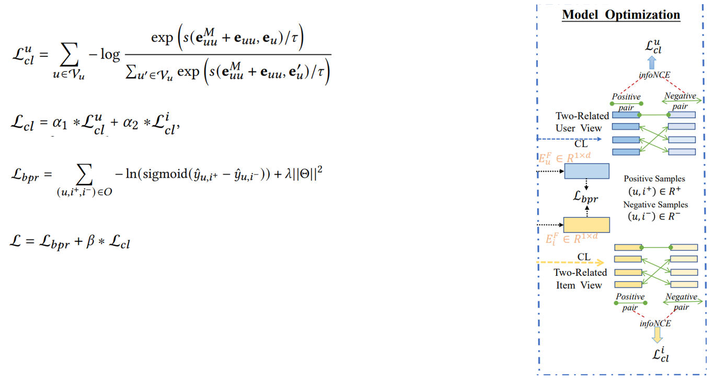

# Heterogeneous Graph Contrastive Learning for Recommendation
## Abstract
图形神经网络（GNNs）已经成为推荐系统中图形结构数据建模的有力工具。然而，现实生活中的推荐场景通常涉及异质关系（例如，社会意识的用户影响，知识意识的项目依赖），其中包含富有成效的信息，以加强用户的偏好学习。在本文中，本文研究了用于推荐的异质图增强关系学习的问题。最近，对比性自我监督学习已经在推荐中获得了成功。有鉴于此，本文提出了异质图对比学习（HGCL），它能够将异质关系语义纳入用户-项目交互建模，并在不同视图之间进行对比学习增强的知识转移。然而，异质侧信息对交互的影响可能因用户和项目而异。为了推进这一想法，本文用元网络加强了异质图对比学习，使个性化的知识转化器具有自适应的对比增强功能。在三个真实世界的数据集上的实验结果表明，HGCL比最先进的推荐方法更有优势。通过消融研究，HGCL方法中的关键部分得到了验证，有利于推荐性能的提高。
## Model
### Overview

### Heterogeneous Learning

### Meta-Network

### Optimization

## Conclusion
在本文中，研究了考虑到异质关系的推荐的图表示学习问题。为了解决这个问题本文提出了一种新型的异质图对比学习模型（HGCL），以自适应的方式将知识从侧面信息转移到用户-物品交互建模中。在本文的HGCL中，本文建议识别信息性的异质关系，以增强协作过滤范式。本文在真实世界的数据集上的实验验证了本文的HGCL在很大程度上超过了最先进的技术。深入分析验证了本文的模型在缓解数据稀少方面的稳健性。未来工作的一个有趣的方向是探索和分离真正的兴趣和一致性，通过在推荐系统中加入异质关系来减轻用户的噪声交互数据的流行偏差。此外，在未来的工作中，探索推荐系统中异质关系学习的混杂效应也很有意思。