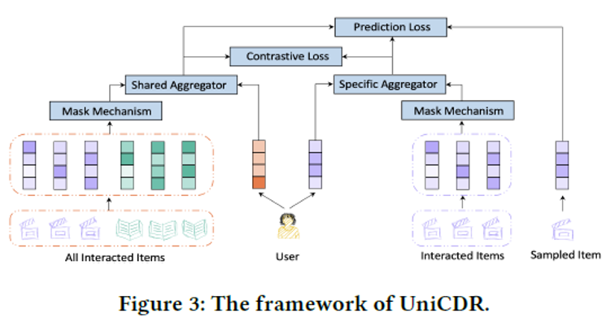
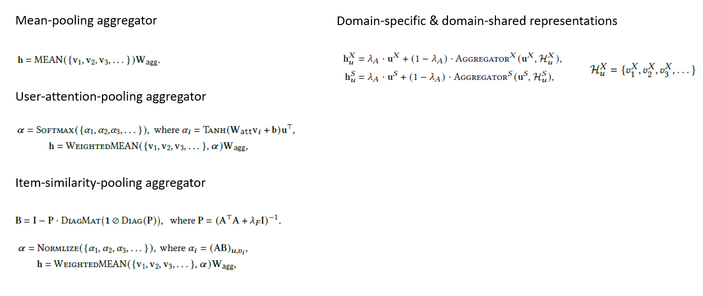
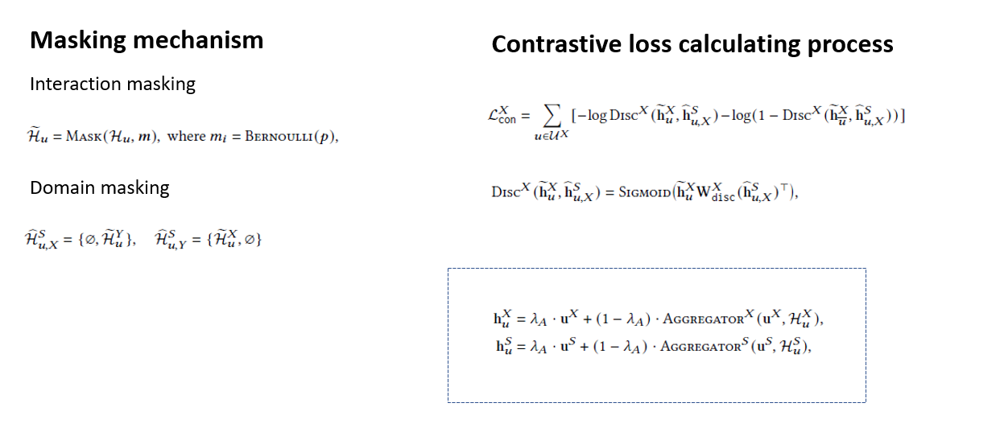

# UniCDR
为跨域推荐系统中数据稀疏和冷启动问题提供了一个统一的解决方案

## Overall

UniCDR通过Mask Mechanism和对比学习来学习域共享的特征和域特定的特征

## Aggregator

文中提供了多种信息聚合方式，包括`Mean-pooling`,`User-attention-pooling`和`Item-similarity-pooling`，也为用户的域特定和域共享表征提供了显式的计算方式，其中用户在每个域的表征以及共享表征都是随机生成的可训练tensor

## Mask & CL

Mask包括交互掩码和域掩码，前者为对部分交互进行mask操作，而后者对整个域的交互进行mask操作，最后通过对比学习来学习到一个较为鲁棒的表征，同时，由于对比学习能够最大化互信息，所以能够学习到一个较好的共享表征。